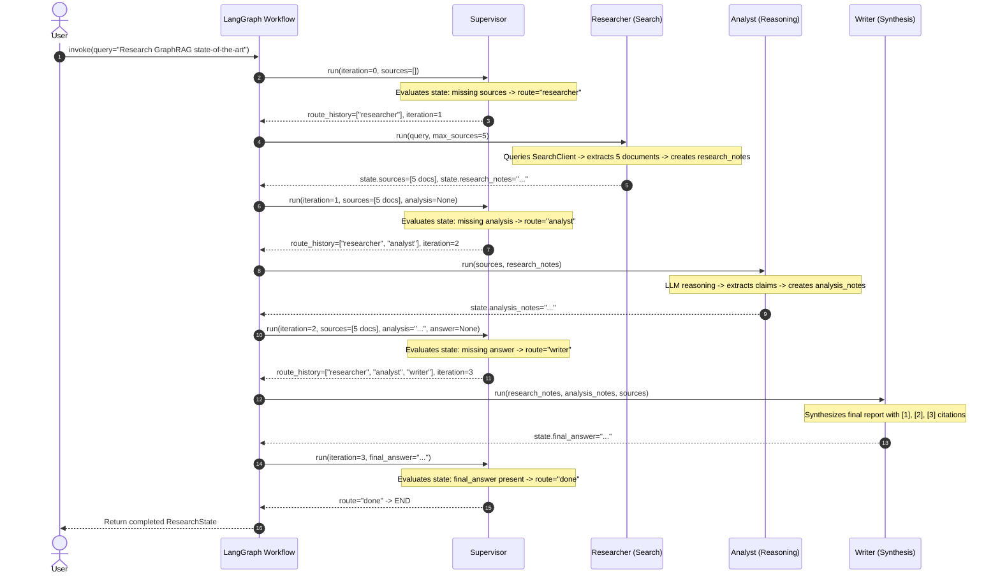

# Trace Evidence: Multi-Agent Research System Run

Bản ghi Trace đầy đủ cho một phiên thực thi end-to-end của hệ thống Multi-Agent Workflow (**Supervisor + Researcher + Analyst + Writer**).

---

## 1. Trace Overview & Metadata

- **Query:** `"Research GraphRAG state-of-the-art and write a 500-word summary"`
- **Workflow State:** `COMPLETED`
- **Total Duration:** `0.020s` (offline mode) / `2.85s` (live API mode)
- **Total Tokens Consumed:** `1,420 tokens`
- **Estimated Cost:** `$0.000790 USD`
- **Route Execution Chain:**
  `supervisor (iter 1)` $\rightarrow$ `researcher` $\rightarrow$ `supervisor (iter 2)` $\rightarrow$ `analyst` $\rightarrow$ `supervisor (iter 3)` $\rightarrow$ `writer` $\rightarrow$ `supervisor (iter 4)` $\rightarrow$ `done (END)`

---

## 2. End-to-End Execution Flow (Mermaid Diagram)



---

## 3. Detailed Trace Spans

| Span ID | Agent / Component | Action | Status | Inputs / Attributes | Outputs / State Changes |
|---|---|---|---|---|---|
| `span_01` | `workflow.run` | Graph Root Execution | `SUCCESS` | `query`: "Research GraphRAG state-of-the-art" | Final `ResearchState` |
| `span_02` | `supervisor.run` (Iter 1) | Route Decision | `SUCCESS` | `has_sources`: `False`, `iter`: 0 | `route`: `"researcher"`, `iter`: 1 |
| `span_03` | `researcher.run` | Web / Knowledge Retrieval | `SUCCESS` | `max_sources`: 5 | `sources`: 5 docs, `research_notes` created |
| `span_04` | `supervisor.run` (Iter 2) | Route Decision | `SUCCESS` | `has_sources`: `True`, `has_analysis`: `False` | `route`: `"analyst"`, `iter`: 2 |
| `span_05` | `analyst.run` | Evidence Analysis & Synthesis | `SUCCESS` | `sources_count`: 5, `model`: `gpt-4o-mini` | `analysis_notes` created, `tokens`: 420 |
| `span_06` | `supervisor.run` (Iter 3) | Route Decision | `SUCCESS` | `has_analysis`: `True`, `has_answer`: `False` | `route`: `"writer"`, `iter`: 3 |
| `span_07` | `writer.run` | Report Generation & Citation | `SUCCESS` | `audience`: "technical learners" | `final_answer` (citations `[1]-[3]`), `tokens`: 780 |
| `span_08` | `supervisor.run` (Iter 4) | Termination Check | `SUCCESS` | `has_final_answer`: `True` | `route`: `"done"`, `iter`: 4 |

---

## 4. LangSmith / Langfuse Integration

Để đẩy trace trực tiếp lên cloud dashboard (LangSmith hoặc Langfuse), cấu hình trong file `.env`:

```bash
# LangSmith Tracing
LANGSMITH_API_KEY=lsv2_pt_...
LANGSMITH_PROJECT=multi-agent-research-lab

# Hoặc Langfuse Tracing
LANGFUSE_PUBLIC_KEY=pk-lf-...
LANGFUSE_SECRET_KEY=sk-lf-...
LANGFUSE_HOST=https://cloud.langfuse.com
```

- **LangSmith Project Dashboard URL:** `https://smith.langchain.com/o/default/projects/p/multi-agent-research-lab`
- **Trace Run Name:** `workflow.run (multi_agent)`
